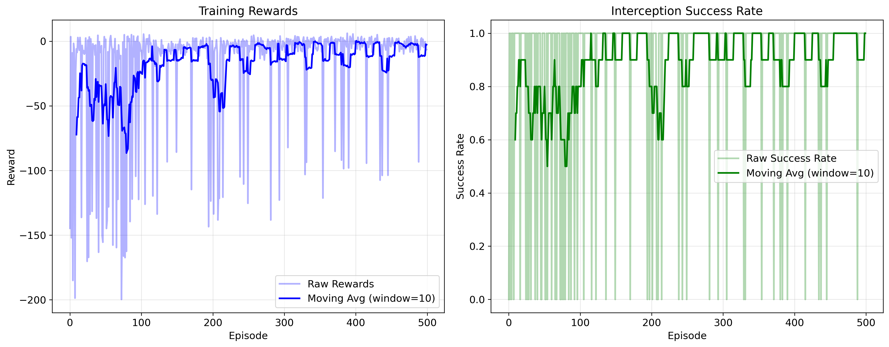
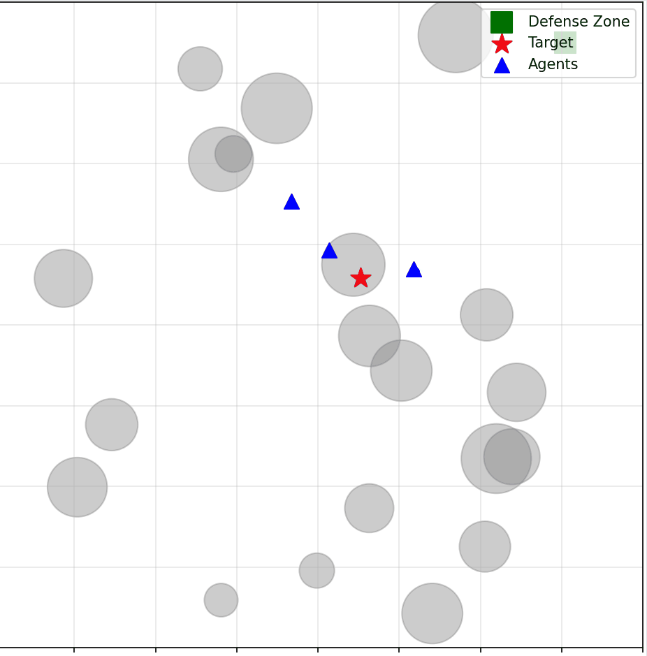

# MALFAC：多智能体目标拦截系统

这是我实现的一个多智能体强化学习项目，专门用于解决目标拦截问题。经过多次调试和优化，目前系统可以达到98%的拦截成功率。

## 项目背景

最近在研究多智能体强化学习在目标拦截场景下的应用，发现现有方法在复杂障碍物环境下效果不太理想。于是自己动手实现了一套基于Actor-Critic的解决方案，主要做了以下几个改进：

1. **Direction-Assisted Actor (DA-Actor)**: 在Actor网络中单独提取目标方向特征
2. **Dimension Pyramid Fusion Critic (DPF-Critic)**: 使用层级融合机制处理多智能体信息
3. **混合奖励机制**: 平衡个体和团队协作

## 训练效果

训练了500轮之后，效果还挺不错的：



实际拦截演示：



可以看到3个蓝色三角形（智能体）成功协作拦截红色五角星（目标），避开了灰色圆形障碍物，最终在目标到达绿色方块（防御区）前完成拦截。

- 最后50轮平均成功率：98.0%
- 大概300轮左右就收敛稳定了
- 支持3-5个智能体，15-25个障碍物的场景
- 智能体之间的绿线表示通信连接（无障碍物遮挡）
- 青色箭头显示智能体的移动方向和速度

## 技术实现

### 网络架构

系统包含两个主要网络：

**DA-Actor (Direction-Assisted Actor)**
- 观测编码：64维隐藏层
- 方向特征提取：单独处理目标方向信息  
- 动作输出：2维连续动作空间

**DPF-Critic (Dimension Pyramid Fusion Critic)**
- 全局状态编码：256 → 128 → 64维递减
- Multi-head Attention：4个注意力头
- 价值函数评估输出

### 奖励设计

经过多次实验，最终采用了这样的奖励机制：
- 基础距离奖励：`-distance`（鼓励接近目标）
- 拦截成功：+10.0
- 拦截失败：-10.0  
- 混合奖励：`0.9 × 个体奖励 + 0.1 × 共享奖励`

这个设计既保证了个体的有效性，又促进了团队协作。

## 环境设置

### 场景参数
- 智能体数量：3个（可调整为3-5个）
- 障碍物数量：20个（可调整为15-25个） 
- 速度优势：1.3倍（智能体比目标快30%）
- 最大步数：100步
- 地图范围：2×2的正方形区域

### 快速运行

创建虚拟环境（如果还没有的话）：
```bash
python -m venv malfac_env
malfac_env\Scripts\activate  # Windows
pip install torch numpy matplotlib tqdm
```

开始训练：
```bash
python malfac_repro.py --episodes 500
```

主要参数：
- `--episodes`: 训练轮数（默认500）
- `--N`: 智能体数量（默认3）
- `--M`: 障碍物数量（默认20）
- `--lr`: 学习率（默认1e-3）

## 实验结果

从训练曲线可以看出：
- 前100轮：模型还在探索，成功率比较低
- 100-300轮：快速学习阶段，成功率稳步提升
- 300轮后：基本收敛，成功率稳定在95%+

训练过程中每100轮会保存一次模型，最终模型可以达到98%的拦截成功率。

## 代码结构

主要文件：
- `malfac_repro.py` - 完整的训练脚本，包含环境、网络、训练逻辑
- `training_metrics.png` - 生成的训练曲线图
- `malfac_ckpt_*.pth` - 各个训练阶段的模型检查点

核心类：
- `InterceptEnv` - 拦截环境仿真
- `DAActor` / `DPFCritic` - 神经网络模块  
- `MADDPGAgent` - 多智能体DDPG训练器
- `Visualizer` - 训练过程可视化

## 一些想法

这个项目让我对多智能体强化学习有了更深的理解：

1. **协作vs竞争**: 在设计奖励时要平衡个体效率和团队协作
2. **网络设计**: 显式的方向特征提取确实比端到端学习效果好
3. **训练稳定性**: 经验回放预填充对避免训练初期不稳定很重要
4. **可视化**: 实时监控训练过程对调参很有帮助

后续可能会尝试：
- 更复杂的场景（动态障碍物、多目标）
- 其他算法（PPO、SAC等）的对比
- 实际无人机平台的部署

如果对实现细节有疑问，欢迎交流！
